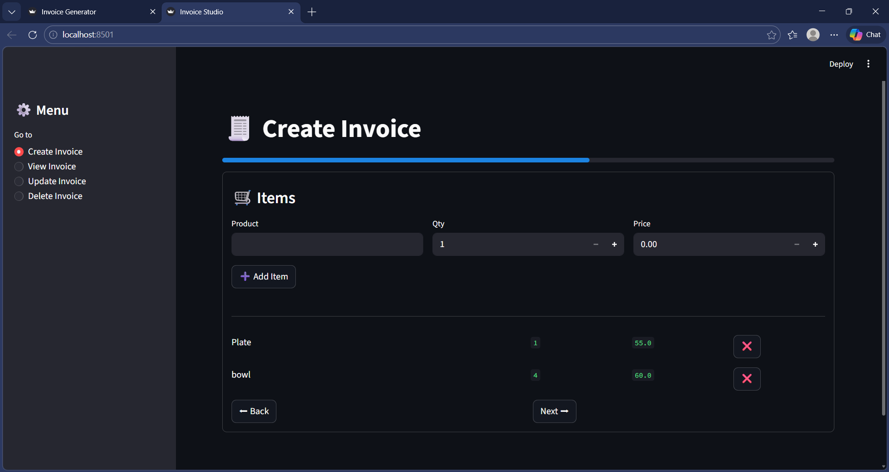
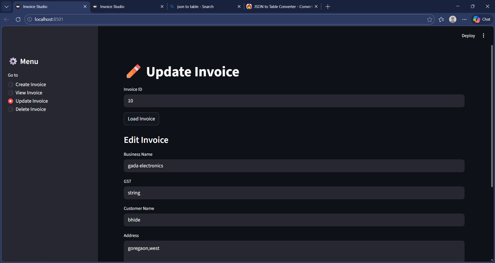
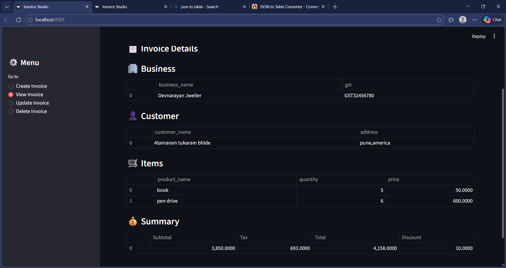

# 🧾 BillCraft Invoice Generator

A simple full-stack invoice generator built as a **learning project** using:

* ⚡ FastAPI (Backend)
* 🧠 Pydantic (Data validation & schema)
* 🎨 Streamlit (Frontend UI)

---

## 🚀 Features

* ✅ Create invoices with step-by-step UI
* 🔍 View invoice details
* ✏️ Update existing invoices
* ❌ Delete invoices
* 📊 Auto calculation (subtotal, tax, total)
* 🧾 Clean table-based UI (no raw JSON)

---

## 🛠️ Tech Stack

| Layer    | Tech      |
| -------- | --------- |
| Backend  | FastAPI   |
| Models   | Pydantic  |
| Frontend | Streamlit |
| Storage  | JSON file |

---

## 📁 Project Structure

```
BillCraft-Invoice-Generator/
│── application.py     # Streamlit frontend
│── main.py            # FastAPI app
│── model.py           # Pydantic models
│── invoice.json       # Local database
│── requirements.txt
│── assets/            # Screenshots
```

---

## 📸 Screenshots

### 🧾 Create Invoice



### ✏️ Update Invoice



### 🔍 View Invoice



---

## ⚙️ How to Run

### 1️⃣ Backend (FastAPI)

```
uvicorn main:app --reload
```

### 2️⃣ Frontend (Streamlit)

```
streamlit run application.py
```

---

## 📌 Notes

* This project uses a **JSON file as a database**
* Designed for **learning FastAPI + Pydantic + Streamlit**
* Not production-ready (no auth, no DB yet)

---

## 👨‍💻 Author

**Prince Jha**

* GitHub:  [princejha-dev](https://github.com/princejha-dev)
* Project: [BillCraft Invoice Generator](https://github.com/your-username/BillCraft-Invoice-Generator)

---

## ⭐ Purpose

This project was built to:

* Understand API design using FastAPI
* Learn data validation with Pydantic
* Build interactive UI using Streamlit
* Combine frontend + backend in a simple project

---

💡 *Feel free to fork, improve, and experiment!*
